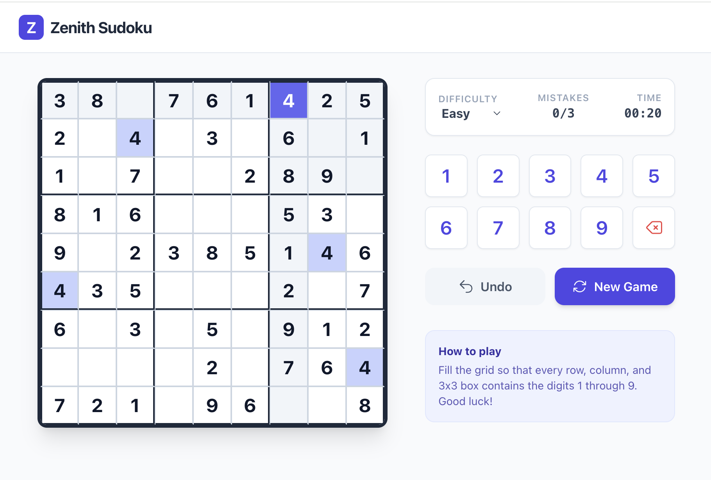

# 🧩 Zenith Sudoku

A modern, responsive Sudoku game built with React and TypeScript featuring algorithmic board generation and multiple difficulty levels.

## How It Works

1. **Board Generation**
   : The game generates complete valid Sudoku boards by filling diagonal boxes and solving with backtracking

2. **Puzzle Creation**
   : Cells are removed based on difficulty level while ensuring unique solutions

3. **Validation**
   : Real-time validation checks moves against the solved grid

4. **Game State**
   : Tracks initial board, current state, and solution for validation
